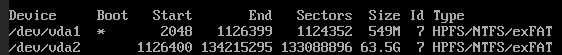

Чтобы изменить пароль администратора на ВМ с ОС Windows, перейдите в **Виртуальные машины** --> выберите ВМ --> меню --> **Изменить пароль** и введите новый пароль.

*В некоторых случаях, например, при сбоях* в работе ОС, пароль может не изменится. В этом случае вы можете сбросить пароль в режиме восстановления.

Статья содержит инструкции, которые могут привести к сбоям работы ОС. Используйте режим восстановления, только если пароль не сбрасывается через интерфейс платформы.

## Пример сброса пароля в ОС Windows Server 2019

---

1. Переведите ВМ в режим восстановления: **Виртуальные машины** --> выберите ВМ --> меню

   --> **Режим восстановления** --> **Запустить режим и перезагрузить**.

2. Дождитесь запуска режима восстановления и подключитесь к ВМ по VNC или SPICE: **Виртуальные машины** --> выберите ВМ --> меню --> **VNC (SPICE).**

3. После загрузки ОС SystemRescueCD подключите раздел с ОС Windows. Для этого:

   1. Введите команду для отображения всех разделов:

      ```
      fdisk -l
      ```

      Результат выполнения команды:

      

   2. Подключите нужный раздел:

      ```
      mount /dev/vda2 /mnt
      ```

      Пояснения к команде

      /dev/vda2 -- раздел с ОС Windows

4. Перейдите в директорию с системными конфигурационными файлами:

   ```
   cd /mnt/Windows/System32/config/
   ```

5. Выведите список пользователей Windows:

   ```
   chntpw -l SAM
   ```

   Пояснения

   RID -- идентификатор учётной записи

   Admin?!!! -- является ли пользователь администратором

6. Запустите утилиту chntpw для сброса пароля:

   ```
   chntpw -u 0x01f4 SAM
   ```

   Пояснения к команде

   01f4 -- идентификатор учётной записи администратора

7. Если учётная запись заблокирована, в меню утилиты будет пункт "2 -- Unlock and enable user account (probably locked now)«. В этом случае введите »2« для разблокировки учётной записи.

8. Введите “1” для сброса пароля учётной записи.

9. Введите “q” для выхода из утилиты и »y« для сохранения внесённых изменений.

10. Проверьте результат работы утилиты:

    ```
    chntpw -l SAM
    ```

    Результат выполнения команды:

    \
    Статус “BLANK” для пользователя Administrator означает, что пароль сброшен.

11. Отключите у ВМ режим восстановления: **Виртуальные машины** --> выберите ВМ --> меню --> **Режим восстановления** --> **Отключить режим и перезагрузить**.

12. Подключитесь к ВМ по VNC или SPICE и установите новый пароль средствами ОС.